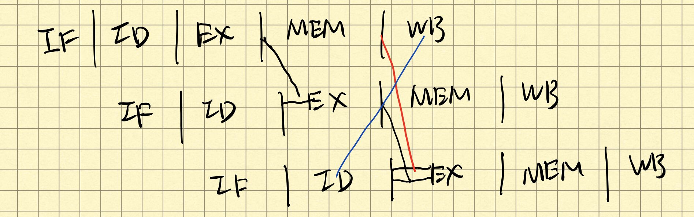

# 4.9 
In this exercise, we examine how data dependences aff ect execution in the basic 5-stage pipeline described in Section 4.5. Problems in this exercise refer to the following sequence of instructions: <br>
```
or r1, r2, r3 
or r2, r1, r4 
or r1, r1, r2
```
Also, assume the following clock cycles for each of the options related to forwarding:<br>
| Without Forwarding | With Full Forwarding | With ALU-ALU Forwarding Only |
| ------------------ | -------------------- | ---------------------------- |
| 250ps              | 300ps                | 290ps                        |

## 4.9.1 [10] <§4.5> 
Indicate dependences and their type.

**A:** 
+ RAW-type: `r1` from `I1` to `I2` and `I3`; `r2` from `I2` to `I3`;
+ WAR-type: `r1` from `I2` to `I3`; `r2` from `I1` to `I2`;
+ WAW-type: `r1` from `I1` to `I3`; 

## 4.9.2 [10] <§4.5> 
Assume there is no forwarding in this pipelined processor. Indicate hazards and add nop instructions to eliminate them. 

**A:** In 5-stages pipline, ID/EX is always before EX/MEM and MEM/WB, so WAR doesn't matter. Due to that WB is always at last, so WAW doen't matter too. As a result, there is a `1a` hazard between `I1` and `I2` by `r1` and a `2a` hazard between `I1` and `I3` by `r1`and a `1b` hazard between `I2` and `I3` by `r2`. To reslove these hazrds caused by RAW, since there is no forwarding, when `I2` wants to read `r1`, it must wait to `r1` has been written. Thus `I1`'s `WB` must concurrent with `I2`'s `ID` with **2** block cycles. The same, `I3` must wait **2** cyccles. Now there are 4 block cycles between `I1` and `I3` and RAW of `r1` from `I1` to `I3` has been resloved.<br>
The final instrcution sequence like this:<br>
```
or r1, r2, r3
nop
nop
or r2, r1, r4
nop
nop
or r1, r1, r2
```

## 4.9.3 [10] <§4.5> 
Assume there is full forwarding. Indicate hazards and add NOP instructions to eliminate them. 

**A:** According to previous question, these hazard are `1a`, `2a`, `1b` hazard, which can be resloved by full-forwarding. So there is no need for NOP.

## 4.9.4 [10] <§4.5> 
What is the total execution time of this instruction sequence without forwarding and with full forwarding? What is the speedup achieved by adding full forwarding to a pipeline that had no forwarding? 

**A:** Without forwarding, it costs `5 + 3 + 3 = 11` cycles, namely, `11 * 250ps = 2750ps`. With full forwarding, it costs `5 + 1 + 1 = 7` cycles, namely, `7 * 300ps = 2100ps`. The speed-up ratio is `2750 / 2100 = 1.31`. 

## 4.9.5 [10] <§4.5> 
Add nop instructions to this code to eliminate hazards if there is ALU-ALU forwarding only (no forwarding from the MEM to the EX stage).

**A:** 
<br>
With only ALU-ALU forwarding, it means there is no MEM-EX forwarding(the red line), so `I3` must wait a cycle for `r1` until it is written(the blue line).<br>
The final instruction sqquence like this:<br>
```
or r1, r2, r3
or r2, r1, r4
nop
or r1, r1, r2
```

## 4.9.6 [10] <§4.5> 
What is the total execution time of this instruction sequence with only ALU-ALU forwarding? What is the speedup over a no-forwarding pipeline?

**A:** With only ALU-ALU forwarding, it costs `5 + 1 + 2 = 8` cycles, namely, `8 * 290ps = 2320ps`. The acceleateing ratio is `2320 / 2100 = 1.10`.

# 4.10 
In this exercise, we examine how resource hazards, control hazards, and Instruction Set Architecture (ISA) design can aff ect pipelined execution. Problems in this exercise refer to the following fragment of MIPS code:<br>    
```
sw  r16, 12(r6)    
lw  r16, 8(r6)    
beq r5, r4, Label # Assume r5!=r4    
add r5, r1, r4    
slt r5, r15, r4 
```
Assume that individual pipeline stages have the following latencies:<br>
| IF    | ID    | EX    | MEM   | WB    |
| ----- | ----- | ----- | ----- | ----- |
| 200ps | 120ps | 150ps | 190ps | 100ps |

## 4.10.1 [10] <§4.5> 
For this problem, assume that all branches are perfectly predicted (this eliminates all control hazards) and that no delay slots are used. If we only have one memory (for both instructions and data), there is a structural hazard every time we need to fetch an instruction in the same cycle in which another instruction accesses data. To guarantee forward progress, this hazard must always be resolved in favor of the instruction that accesses data. What is the total execution time of this instruction sequence in the 5-stage pipeline that only has one memory? We have seen that data hazards can be eliminated by adding nops to the code. Can you do the same with this structural hazard? Why? 

**A:** The multi-cycle pipline diagram like this:<br>
```
IF  ID  EX  MEM WB                                      # sw
    IF  ID  EX  MEM WB                                  # lw
        IF  ID  EX  MEM WB                              # beq
            stall...                                    # stall
                stall...                                # stall
                    IF  ID  EX  MEM WB                  # add
                        IF  ID  EX  MEM WB              # slt
```
There are two **stalls** but not **NOP** after `beq`, because when `add` fetch instructions from memory, `lw` or `sw` is using it, so `add` must wait to `lw` and `sw` finish the visiting to memory. Although NOP can eliminated data hazard, but here NOP also needs to fetch instrution. As long as doing IF operation, it will crash with `lw` and `sw` in the only memory, so NOP can't help.

## 4.10.2 [20] <§4.5> 
For this problem, assume that all branches are perfectly predicted (this eliminates all control hazards) and that no delay slots are used. If we change load/store instructions to use a register (without an off set) as the address, these instructions no longer need to use the ALU. As a result, MEM and EX stages can be overlapped and the pipeline has only 4 stages. Change this code to accommodate this changed ISA. Assuming this change does not aff ect clock clock cycle, what speedup is achieved in this instruction sequence? 

**A:**
Since there's no control hazard and strcuture hazard and data hazard, so there's no need for stall or NOP.<br> 
The multi-cycle 5-stages pipline diagram like this:<br>
```
IF  ID  EX  MEM WB                                      # sw
    IF  ID  EX  MEM WB                                  # lw
        IF  ID  EX  MEM WB                              # beq
            IF  ID  EX  MEM WB                          # add
                IF  ID  EX  MEM WB                      # slt
```
The multi-cycle 4-stages pipline diagram like this:<br>
```
IF  ID  EX/MEM  WB                                         # sw
    IF  ID  EX/MEM WB                                      # lw
        IF  ID  EX/MEM WB                                  # beq
            IF  ID  EX/MEM WB                              # add
                IF  ID  EX/MEM WB                          # slt
```
We can see 5-stages pipline needs **9** cycles and 4-stages pipline needs **8** cycles. With same cycles time, the speed-up ratio is `9 / 8 = 1.13`.  

## 4.10.3 [10] <§4.5> 
Assuming stall-on-branch and no delay slots, what speedup is achieved on this code if branch outcomes are determined in the ID stage, relative to the execution where branch outcomes are determined in the EX stage? 

**A:**
Determine at `ID`:<br>
```
IF  ID  EX  MEM WB                                          # sw
    IF  ID  EX  MEM WB                                      # lw
        IF  ID  EX  MEM WB                                  # beq
            **  IF  ID  EX  MEM WB                          # add
                    IF  ID  EX  MEM WB                      # slt
```
Determine at `EX`:<br>
```
IF  ID  EX  MEM WB                                          # sw
    IF  ID  EX  MEM WB                                      # lw
        IF  ID  EX  MEM WB                                  # beq
            **  **  IF  ID  EX  MEM WB                      # add
                        IF  ID  EX  MEM WB                  # slt
```
We can see the speed-up ratio is `11 / 10 = 1.1`.

## 4.10.4 [10] <§4.5> 
Given these pipeline stage latencies, repeat the speedup calculation from 4.10.2, but take into account the (possible) change in clock clock cycle. When EX and MEM are done in a single stage, most of their work can be done in parallel. As a result, the resulting EX/MEM stage has a latency that is the larger of the original two, plus 20 ps needed for the work that could not be done in parallel. 

**A:**
The multi-cycle 5-stages pipline diagram like this:<br>
```
IF  ID  EX  MEM WB                                      # sw
    IF  ID  EX  MEM WB                                  # lw
        IF  ID  EX  MEM WB                              # beq
            IF  ID  EX  MEM WB                          # add
                IF  ID  EX  MEM WB                      # slt
```
Thus, total time is `200 * 9 = 1800ps`.<br>
The multi-cycle 4-stages pipline diagram like this:<br>
```
IF  ID  EX/MEM  WB                                         # sw
    IF  ID  EX/MEM WB                                      # lw
        IF  ID  EX/MEM WB                                  # beq
            IF  ID  EX/MEM WB                              # add
                IF  ID  EX/MEM WB                          # slt
```
Thus, total time is `(190 + 20) * 8 = 1680ps`.<br>
The speed-up ratio is `1800 / 1680 = 1.07`.

## 4.10.5 [10] <§4.5> 
Given these pipeline stage latencies, repeat the speedup calculation from 4.10.3, taking into account the (possible) change in clock clock cycle. Assume that the latency ID stage increases by 50% and the latency of the EX stage decreases by 10ps when branch outcome resolution is moved from EX to ID.

**A:**
Determine at `ID`:<br>
```
IF  ID  EX  MEM WB                                          # sw
    IF  ID  EX  MEM WB                                      # lw
        IF  ID  EX  MEM WB                                  # beq
            **  IF  ID  EX  MEM WB                          # add
                    IF  ID  EX  MEM WB                      # slt
```
ID's latency increases to 180ps, EX's latency decrases to 140ps. But clock cycle is determined by the longest operation which is IF, so the clock cycle is still `200ps`,  the total time is `10 * 200 = 2000ps`.<br>
Determine at `EX`:<br>
```
IF  ID  EX  MEM WB                                          # sw
    IF  ID  EX  MEM WB                                      # lw
        IF  ID  EX  MEM WB                                  # beq
            **  **  IF  ID  EX  MEM WB                      # add
                        IF  ID  EX  MEM WB                  # slt
```
The total time is `11 * 200 = 2200ps`<br>
The speed-up ratio is `2200 / 2000 = 1.1`.

## 4.10.6 [10] <§4.5> 
Assuming stall-on-branch and no delay slots, what is the new clock clock cycle and execution time of this instruction sequence if beq address computation is moved to the MEM stage? What is the speedup from this change? Assume that the latency of the EX stage is reduced by 20 ps and the latency of the MEM stage is unchanged when branch outcome resolution is moved from EX to MEM.

**A:**
Determine at `MEM`:<br>
```
IF  ID  EX  MEM WB                                          # sw
    IF  ID  EX  MEM WB                                      # lw
        IF  ID  EX  MEM WB                                  # beq
            **  **  **  IF  ID  EX  MEM WB                  # add
                            IF  ID  EX  MEM WB              # slt
```
Since IF still cost most time, so clock cycle remains as **200ps**. Total time is `12 * 200 = 2400ps`. The speed-up ratio is `2200 / 2400 = 0.92`.(speed-down)

# 4.11 
Consider the following loop.<br> 
```
loop:   lw  r1, 0(r1)     
        and r1, r1, r2     
        lw  r1, 0(r1)     
        lw  r1, 0(r1)     
        beq r1, r0, loop 
```
Assume that perfect branch prediction is used (no stalls due to control hazards), that there are no delay slots, and that the pipeline has full forwarding support. Also assume that many iterations of this loop are executed before the loop exits. 

## 4.11.1 [10] <§4.6> 
Show a pipeline execution diagram for the third iteration of this loop, from the cycle in which we fetch the first instruction of that iteration up to (but not including) the cycle in which we can fetch the first instruction of the next iteration. Show all instructions that are in the pipeline during these cycles (not just those from the third iteration). 

**A:**
Since when the third iteration is excuting, the first iteration has been done. So we consider from the second iteration to the forth iteration. The multi-cycle pipline diagram like this:<br>
```
IF  ID  EX  MEM WB
    IF  ID  **  EX  MEM WB
        IF  **  ID  **  EX  MEM WB
                IF  **  ID  **  EX  MEM WB
                        IF  **  ID  **  EX  MEM WB      # the second iteration end
                                IF  **  ID  EX  MEM WB
                                        IF  ID  **  EX  MEM WB
                                            IF  **  ID  **  EX  MEM WB
                                                    IF  **  ID  **  EX  MEM WB
                                                            IF  **  ID  **  EX  MEM WB      # the third iteration end
                                                                    IF  **  ID  EX  MEM WB
                                                                            IF  ID  **  EX  MEM WB
                                                                                IF  **  ID  **  EX  MEM WB
``` 

## 4.11.2 [10] <§4.6> 
How often (as a percentage of all cycles) do we have a cycle in which all five pipeline stages are doing useful work?

**A:**

# 4.13 
This exercise is intended to help you understand the relationship between forwarding, hazard detection, and ISA design. Problems in this exercise refer to the following sequence of instructions, and assume that it is executed on a 5-stage pipelined datapath:<br>
```
add r5, r2, r1 
lw  r3, 4(r5) 
lw  r2, 0(r2) 
or  r3, r5, r3 
sw  r3, 0(r5)
```

## 4.13.1 [5] <§4.7> 
If there is no forwarding or hazard detection, insert nops to ensure correct execution.

**A:**

## 4.13.2 [10] <§4.7> 
Repeat 4.13.1 but now use nops only when a hazard cannot be avoided by changing or rearranging these instructions. You can assume register R7 can be used to hold temporary values in your modifi ed code. 

**A:**

## 4.13.3 [10] <§4.7> 
If the processor has forwarding, but we forgot to implement the hazard detection unit, what happens when this code executes? 

**A:**

## 4.13.4 [20] <§4.7> 
If there is forwarding, for the first five cycles during the execution of this code, specify which signals are asserted in each cycle by hazard detection and forwarding units in Figure 4.60. 

**A:**

## 4.13.5 [10] <§4.7> 
If there is no forwarding, what new inputs and output signals do we need for the hazard detection unit in Figure 4.60? Using this instruction sequence as an example, explain why each signal is needed.

**A:**

## 4.13.6 [20] <§4.7> 
For the new hazard detection unit from 4.13.5, specify which output signals it asserts in each of the fi rst fi ve cycles during the execution of this code.

**A:**

# 4.14 
This exercise is intended to help you understand the relationship between delay slots, control hazards, and branch execution in a pipelined processor. In this exercise, we assume that the following MIPS code is executed on a pipelined processor with a 5-stage pipeline, full forwarding, and a predict-taken branch predictor:                   
        lw r2, 0(r1) 
label1: beq r2, r0, label2      # not taken once, then taken        
        lw r3, 0(r2)        
        beq r3, r0, label1      # taken        
        add r1, r3, r1 
label2: sw r1, 0(r2) 

## 4.14.1 [10] <§4.8> 
Draw the pipeline execution diagram for this code, assuming there are no delay slots and that branches execute in the EX stage. 

**A:**

## 4.14.2 [10] <§4.8> 
Repeat 4.14.1, but assume that delay slots are used. In the given code, the instruction that follows the branch is now the delay slot instruction for that branch. 

**A:**

## 4.14.3 [20] <§4.8> 
One way to move the branch resolution one stage earlier is to not need an ALU operation in conditional branches. Th e branch instructions would be “bez rd,label” and “bnez rd,label”, and it would branch if the register has and does not have a zero value, respectively. Change this code to use these branch instructions instead of beq. You can assume that register R8 is available for you to use as a temporary register, and that an seq (set if equal) R-type instruction can be used.
366 Chapter 4 The Processor
Section 4.8 describes how the severity of control hazards can be reduced by moving branch execution into the ID stage. Th is approach involves a dedicated comparator in the ID stage, as shown in Figure 4.62. However, this approach potentially adds to the latency of the ID stage, and requires additional forwarding logic and hazard detection. 

**A:**

## 4.14.4 [10] <§4.8> 
Using the fi rst branch instruction in the given code as an example, describe the hazard detection logic needed to support branch execution in the ID stage as in Figure 4.62. Which type of hazard is this new logic supposed to detect? 

**A:**

## 4.14.5 [10] <§4.8> 
For the given code, what is the speedup achieved by moving branch execution into the ID stage? Explain your answer. In your speedup calculation, assume that the additional comparison in the ID stage does not aff ect clock cycle time. 

**A:**

## 4.14.6 [10] <§4.8> 
Using the fi rst branch instruction in the given code as an example, describe the forwarding support that must be added to support branch execution in the ID stage. Compare the complexity of this new forwarding unit to the complexity of the existing forwarding unit in Figure 4.62.

**A:**

