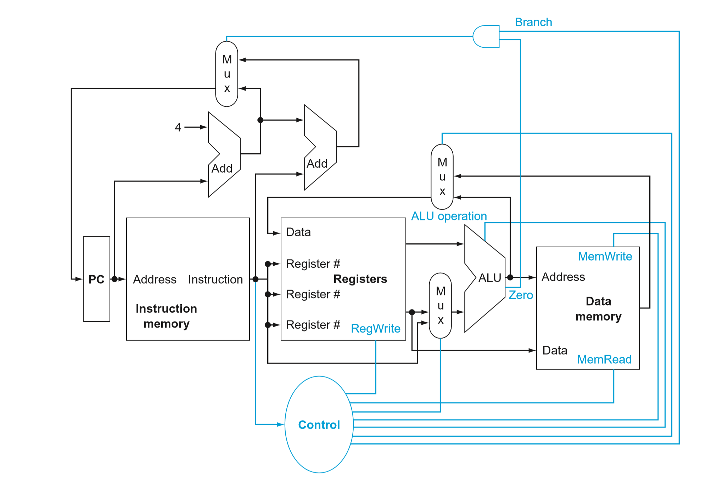
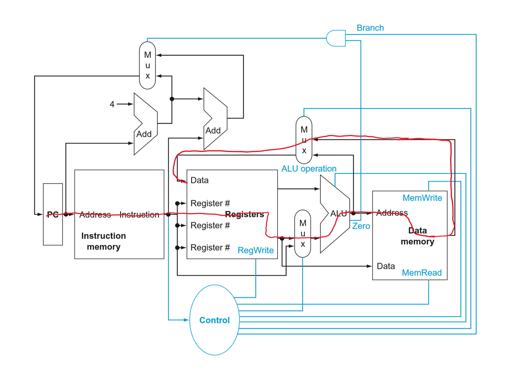
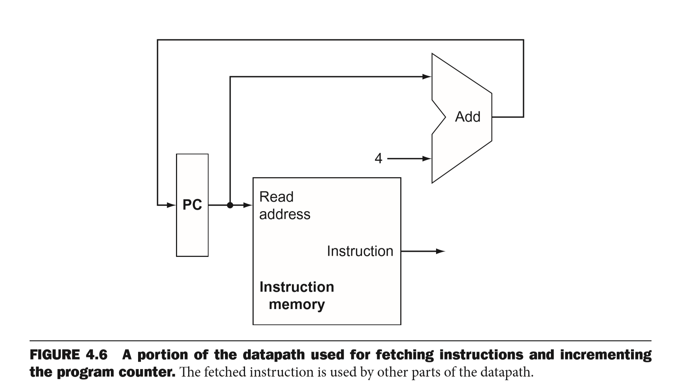
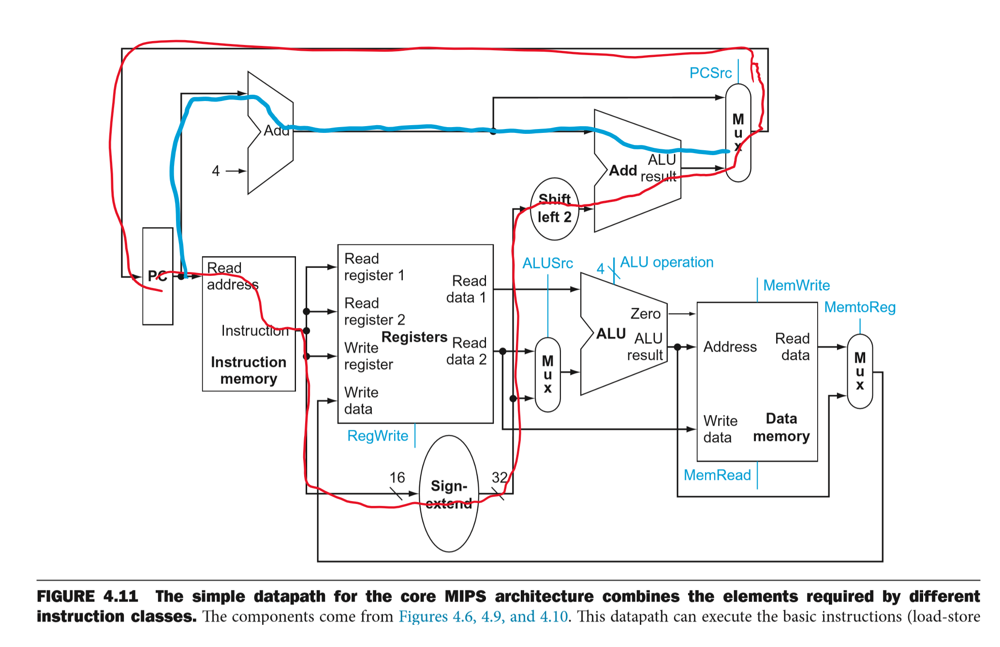
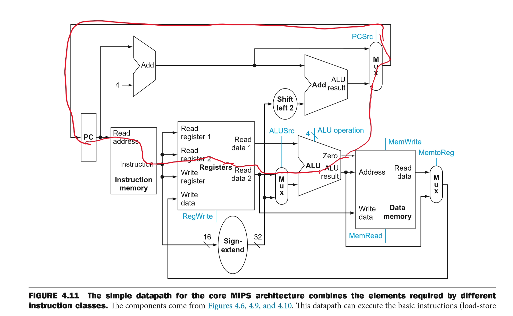
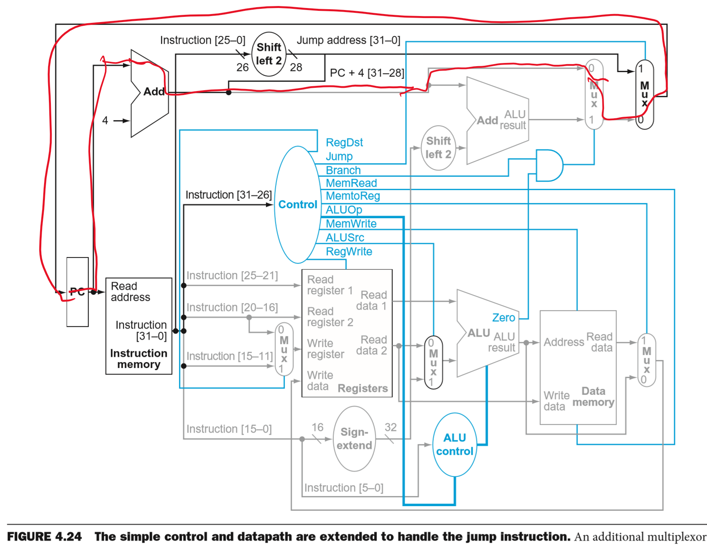
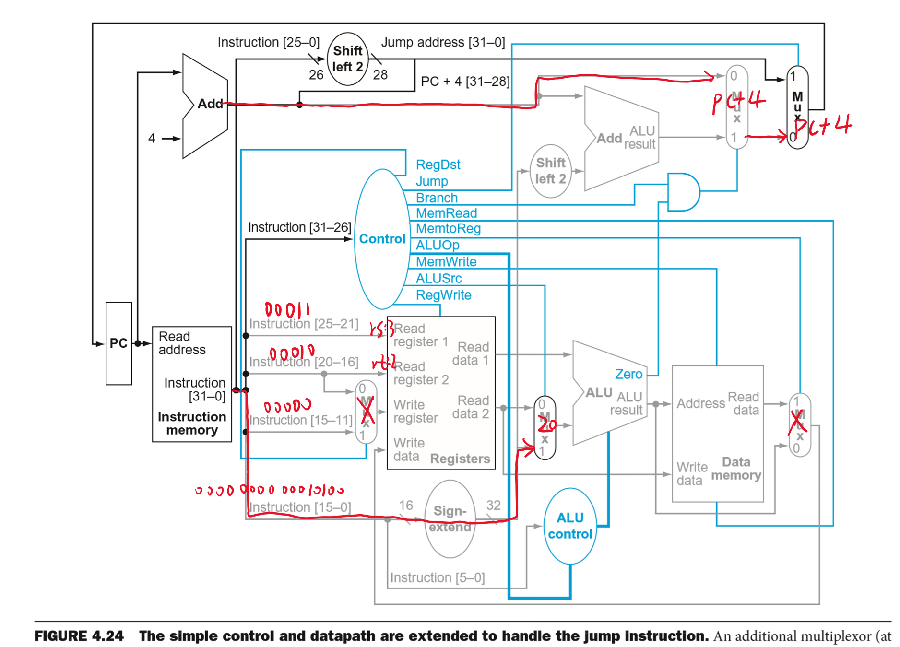
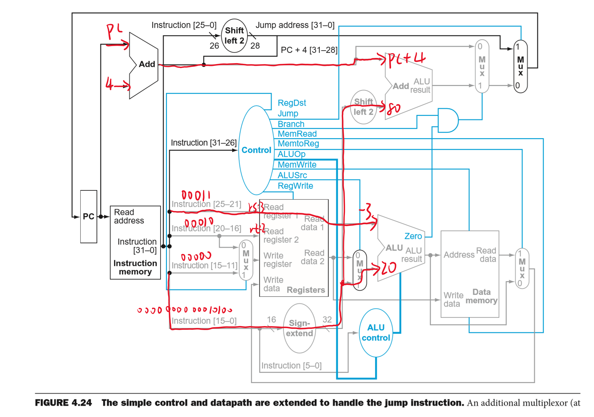
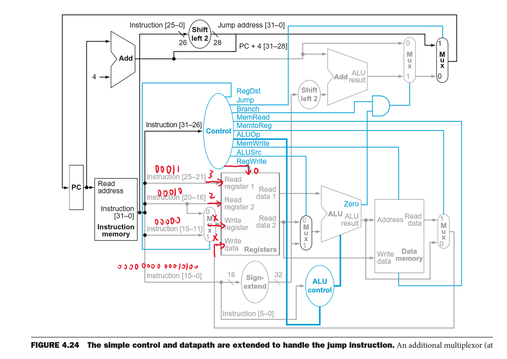

# 4.3 
When processor designers consider a possible improvement to the processor datapath, the decision usually depends on the cost/performance trade-off . In the following three problems, assume that we are starting with a datapath from Figure 4.2, where I-Mem, Add, Mux, ALU, Regs, D-Mem, and Control blocks have latencies of 400 ps, 100 ps, 30 ps, 120 ps, 200 ps, 350 ps, and 100 ps, respectively, and costs of 1000, 30, 10, 100, 200, 2000, and 500, respectively. Consider the addition of a multiplier to the ALU.  This addition will add 300 ps to the latency of the ALU and will add a cost of 600 to the ALU.  Th e result will be 5% fewer instructions executed since we will no longer need to emulate the MUL instruction. 

## 4.3.1 [10] <§4.1> 
What is the clock cycle time with and without this improvement? 

**A:** Clock cycle time equals to the instrcution which takes the longest time. According to the condition, Regs > Add and Control blocks, so the critial path like the red one:

Thus, the answer is:

Without this improvement: cycle time = I-Mem + Regs + Mux + ALU + D-Mem + Mux = 400 + 200 + 30 + 120 + 350 + 30 = **1130 ps**

With this improvement: cycle time = I-Mem + Regs + Mux + ALU(new) + D-Mem + Mux = 400 + 200 + 30 + (120 + 300) + 350 + 30 = **1430 ps**

## 4.3.2 [10] <§4.1> 
What is the speedup achieved by adding this improvement?

**A:** time cost ratio = (new instructions * new cycle time) / (old instructions * old cycle time) = (0.95 * 1430) / (1 * 1130) = 1.20

Thus, the performance ratio is 1/1.20 = **0.83**. By adding this improvement, it speeds down to 0.83.

## 4.3.3 [10] <§4.1> 
Compare the cost/performance ratio with and without this improvement.

**A:** old cost = I-Mem + 2 * Add + 3 * Mux + ALU + Regs + D-Mem + Control blocks = 1000 + 2 * 30 + 3 * 10 + 100 + 200 + 2000 + 500 = 3890

new cost = I-Mem + 2 * Add + 3 * Mux + (ALU + mul) + Regs + D-Mem + Control blocks = 1000 + 30 + 10 + (100 + 600) + 200 + 2000 + 500 = 4490

Thus, the cost/performance ratio is (new cost / old cost) * (old performance / new performance) = 4490/3890 * 1.2 = **1.385**. The lower performance, but the higher cost/performance ratio.

# 4.4
Problems in this exercise assume that logic blocks needed to implement a processor’s datapath have the following latencies:

|I-Mem|Add|Mux|ALU|Regs|D-Mem|Sign-Extend|Shift-Left-2|
|-|-|-|-|-|-|-|-|
|200ps|70ps|20ps|90ps|90ps|250ps|15ps|10ps|

## 4.4.1 [10] <§4.3> 
If the only thing we need to do in a processor is fetch consecutive instructions (Figure 4.6), what would the cycle time be? 

**A:** Due to that I-Mem cost more time than Add, so the cycle time = I-Mem = **200 ps**

## 4.4.2 [10] <§4.3> 
Consider a datapath similar to the one in Figure 4.11, but for a processor that only has one type of instruction: unconditional PC-relative branch. What would the cycle time be for this datapath? 

**A:**  The critial datapath is the red one, so the cycle time = I-Mem + Sign-Extend + Shift-Left-2 + Add + Mux = 200 + 15 + 10 + 70 + 20 = **315 ps**

## 4.4.3 [10] <§4.3> 
Repeat 4.4.2, but this time we need to support only conditional PC-relative branches. The remaining three problems in this exercise refer to the datapath element Shift left -2: 

**A:** The critial datapath is the red one, so the cycle time = I-Mem + Regs + Mux + ALU + Mux = 200 + 90 + 20 + 90 + 20 = **420 ps**

## 4.4.4 [10] <§4.3> 
Which kinds of instructions require this resource? 

**A:** All PC-relative branch instructions need Shift-left-2. Because PC counted by bytes, but in Add unit, it adds with words, so we should transfer the words into bytes by shitf-left-2.

## 4.4.5 [20] <§4.3> 
For which kinds of instructions (if any) is this resource on the critical path? 

**A:** In **unconditional PC-relative branch instructions**. Because in conditional PC-relative branch instrucitons, the data will pass Regs and a Mux and a ALU unit which cost more time(200 ps) than Sig-extend -> Shift-left-2 -> Add (95 ps), thus it won't on the critical path.

## 4.4.6 [10] <§4.3> 
Assuming that we only support beq and add instructions, discuss how changes in the given latency of this resource affect the cycle time of the processor. Assume that the latencies of other resources do not change.

**A:** By 4.4.5, in conditional instructions, the critical path is I-Mem -> Regs -> Mux -> ALU -> Mux; in unconditional instructions, the critical path is I-Mem -> Sign-extend -> Shift-left-2 -> Add -> Mux. So the difference is **Regs -> Mux -> ALU**(200 ps) and **Sign-extend -> Shift-left-2 -> Add**(95 ps). If Shift-left-2 unit want to affect the critical path, it needs to cost at least **200 - 95 = 105 ps** more. 

# 4.7
In this exercise we examine in detail how an instruction is executed in a single-cycle datapath. Problems in this exercise refer to a clock cycle in which the processor fetches the following instruction word: 10101100011000100000000000010100. Assume that data memory is all zeros and that the processor’s registers have the following values at the beginning of the cycle in which the above instruction word is fetched:

|r0|r1|r2|r3|r4|r5|r6|r8|r12|r31|
|-|-|-|-|-|-|-|-|-|-|
|0|–1|2|–3|–4|10|6|8|2|–16|

## 4.7.1 [5] <§4.4> 
What are the outputs of the sign-extend and the jump “Shift  left  2” unit (near the top of Figure 4.24) for this instruction word? 

**A:** Sign-extend operate the lower 26 bits of instruction: **00000000011000100000000000010100**, thus the result of shift-left-2: **00000001100010000000000001010000**

## 4.7.2 [10] <§4.4> 
What are the values of the ALU control unit’s inputs for this instruction? 

**A:** The inputs of ALU control unit includes two part: ALUOp and funct code. Due to that the Op code is 101011 which equals to 43, so this is a `sw` instrcution, whose **ALUOp is 00**. The funct code is the lower 6 bits of instruction: **010100**.

## 4.7.3 [10] <§4.4> 
What is the new PC address after this instruction is executed? Highlight the path through which this value is determined.

**A:** The new PC is PC + 4. The path which determine the value is the red one:

## 4.7.4 [10] <§4.4> 
For each Mux, show the values of its data output during the execution of this instruction and these register values. 

**A:** 

## 4.7.5 [10] <§4.4> 
For the ALU and the two add units, what are their data input values? 

**A:** 

## 4.7.6 [10] <§4.4> 
What are the values of all inputs for the “Registers” unit?

**A:** 

