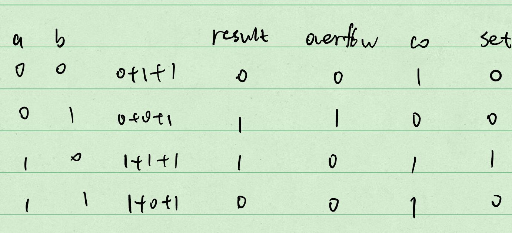
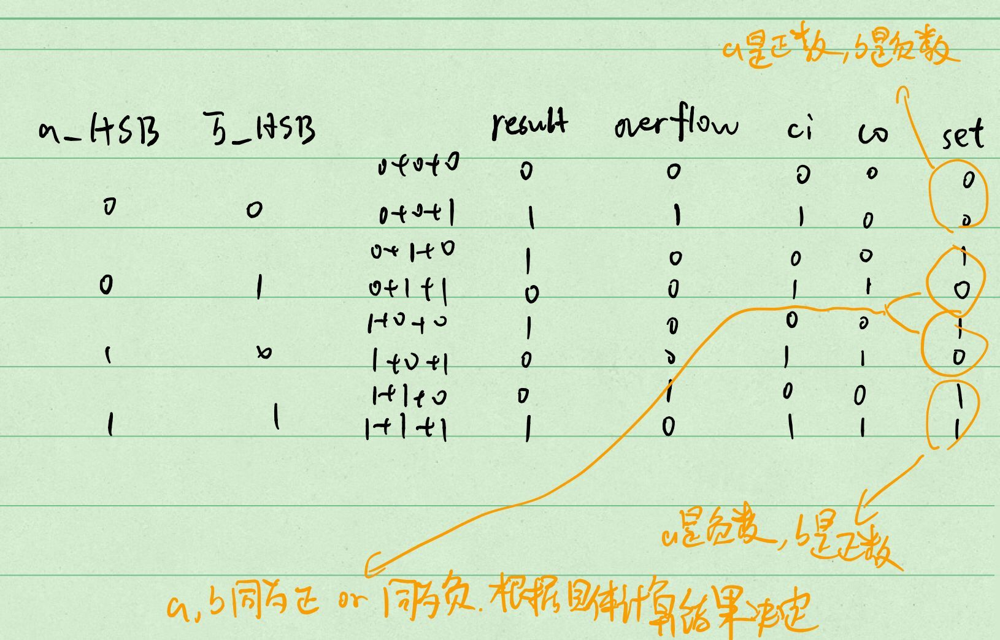
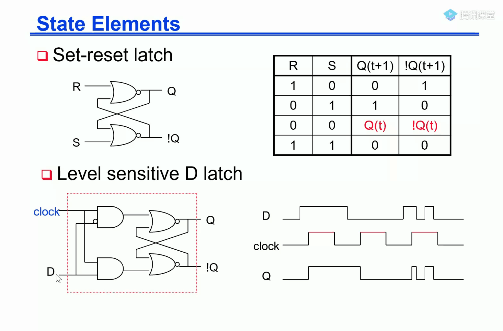
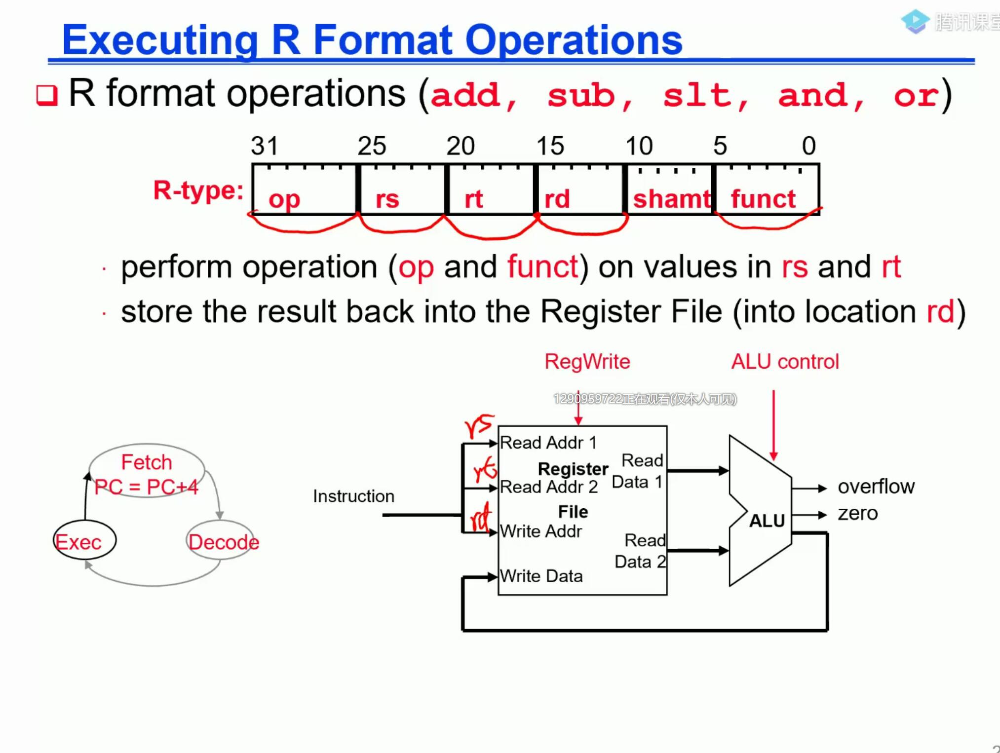

# 杂七杂八
+ 指令和数据存储分开，指令存储器只读，数据存储器支持读写。
+ latch-锁存器，flipflops-触发器
+ 关于slt：

slt一位数的情况：

slt多位数的情况：

Set-reset latch:

其中，第二张图在clock高电平时与D一致，低电平时保持。

latch电平触发，flipflop边沿触发

R型指令处理图：

几种操作中，lw步骤最多，所以单周期的时间以他为准